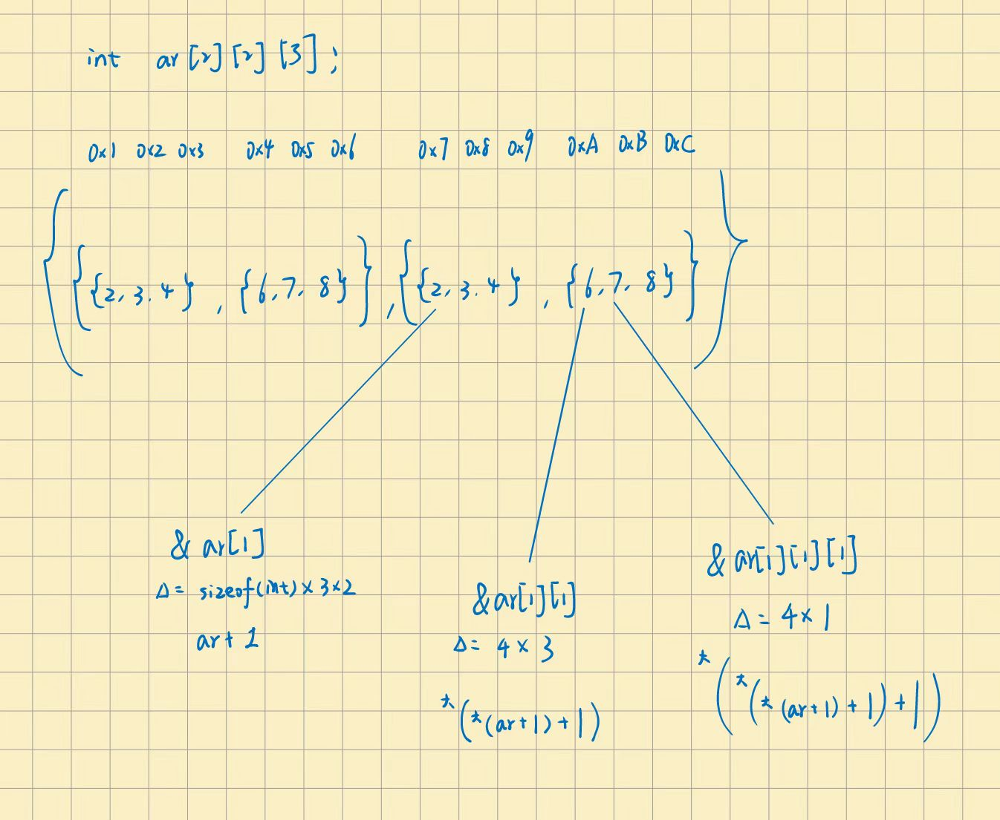

计算数组大小

```c
    int array = {1,2,3,4,5};
    int arraySize = sizeof(array) / sizeof(array[0]);
```

变长数组（VLA）

```c
    int array[n]; // 声明边长数组的时候不能初始化
```

多维数组

```c
    int array[2][3]; // 包含两个数组元素的数组

    int a, b; // 用双层for循环遍历数组
    for(a = 0; a < 2; a++){
        for(b = 0; b < 3; b++){
            array[a][b] = b;
        }
    }
```

指针偏移对应的地址运算：地址按字节编址，short类型占用2字节，double类型占用8字节。在C中，指针加1指的是增加一个存储单元。对数组而言，这意味着加1后的地址是下一个元素的地址，而不是下一个字节的地址。

```c
    short *shp;     // shp + 1对应的地址值+2字节 
    double *doup;   // doup + 1对应地址值+8字节，这也是为什么需要声明指针类型的原因
```

指针和数组

```c
    int array;
    array == &array[0];         // 数组名 == 数组首元素的地址
    array[n] == *(array + n);   // 数组元素名 == 指针（加偏移量）
    
    &(array[n]) == array + n;
```

利用const保护数据

```c
    const int* p;       // 无法修改*p指向的变量，可以修改地址p

    int* const p;       // 可以修改*p指向的变量，无法修改地址p

    const int* const p; // 无法修改*p指向的变量，无法修改地址p
```

# 指针
指针是C的一种数据类型，指针变量占用的内存大小是固定的4字节或8字节（32bit系统/64bit系统）

>注意：指针占用的内存大小不等于sizeof(*p)的返回值，sizeof(*p)返回的是“指针指向的变量的大小”，它也是指针加减运算的跳转步长

指针包含以下信息：
- `单个`储存单元的地址（某一个字节的地址）
- 指针指向的数据类型

指向的数据类型，比如int，float，double，数组。决定了指针进行加减运算时的步长

```c
int * pint;
char * pchar;
double * pdou;
int (*par)[5];
printf("%lu\n", sizeof(*pint));  //4
printf("%lu\n", sizeof(*pchar)); //1
printf("%lu\n", sizeof(*pdou));  //8
printf("%lu\n", sizeof(*par));   //20

printf("%lu\n", sizeof(pint));  //8
printf("%lu\n", sizeof(pchar)); //8
printf("%lu\n", sizeof(pdou));  //8
printf("%lu\n", sizeof(par));   //8
```
[C语言——指针_c语言指针_王同学要变强的博客-CSDN博客](/media/C%E8%AF%AD%E8%A8%80%E2%80%94%E2%80%94%E6%8C%87%E9%92%88_c%E8%AF%AD%E8%A8%80%E6%8C%87%E9%92%88_%E7%8E%8B%E5%90%8C%E5%AD%A6%E8%A6%81%E5%8F%98%E5%BC%BA%E7%9A%84%E5%8D%9A%E5%AE%A2-CSDN%E5%8D%9A%E5%AE%A2.mhtml)

[C语言——指针（进阶版）_c语言指针_王同学要变强的博客-CSDN博客](/media/C%E8%AF%AD%E8%A8%80%E2%80%94%E2%80%94%E6%8C%87%E9%92%88%EF%BC%88%E8%BF%9B%E9%98%B6%E7%89%88%EF%BC%89_c%E8%AF%AD%E8%A8%80%E6%8C%87%E9%92%88_%E7%8E%8B%E5%90%8C%E5%AD%A6%E8%A6%81%E5%8F%98%E5%BC%BA%E7%9A%84%E5%8D%9A%E5%AE%A2-CSDN%E5%8D%9A%E5%AE%A2.mhtml)


# 指针数组和数组指针
## 数组指针
`par`是一个指针，它指向一个`包含5个整数元素的数组`
```c
int (*par)[5];
```
1. 处理`(*par)`，`*` 与 `par` 结合，表示`par`是一个指针变量
2. 处理`int [5]`，表示指针par指向的是一个包含5个整数元素的数组
- 指针par的跳转步长为`sizeof(int) * 5= 20`字节
## 指针数组
`par`是一个包含5个元素的数组，它的元素为整形指针
```c
int *par[5];
```
1. 处理`par[5]`，表示`par`是一个包含5个元素的`数组`
2. 处理`int *`，表示数组`par`的元素的类型为`整形指针`
- 指针par的跳转步长为`4字节`（32bit机器中）


# 数组
```c
int ar[3] = {2,3,4};
    printf("%p\n", ar);         //0x1
    printf("%p\n", ar+1);       //0x5
    printf("%lu\n", sizeof ar); //12
    printf("%d", *ar);          //2
```
分配一块内存，长度为 3 * sizeof(int) = 12 bytes, 对应地址 0x1 - 0xD ,数组名ar是一个指针，地址为数组首元素`在内存中占用的第一个存储单元`的地址，指针ar的`跳转步长`为单个数组元素的大小。

## 多维数组和指针

由于数组名是一个指针且地址为数组首元素在内存中占用的第一个存储单元的地址，所以
- 指针`ar[0]`,`ar[0][0]`,`ar[0][0][0]`的地址均为`0x1`

但是，这几个指针指向的数据类型不同，跳转步长也不同，这里用Δ代表跳转步长：

- `ar[0]`指向一个数组(该数组是ar数组的第一个元素，即图中的{{2，3，4}，{6，7，8}})，该数组包含两个子数组，子数组包含3个整型元素。因此Δ = sizeof(int) * 3 * 2
- `ar[0][0]`指向一个数组，即图中的{2，3，4}，因此Δ = sizeof(int) * 3
- `ar[0][0][0]`指向一个整数2，因此Δ = sizeof(int) * 1